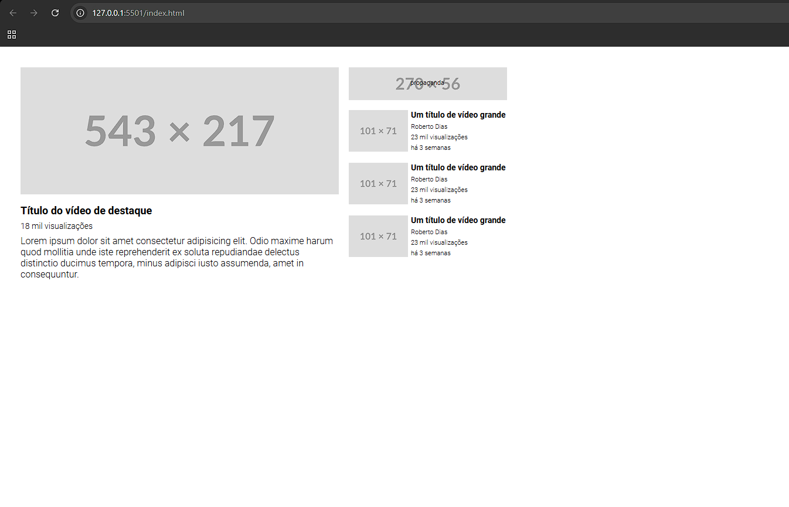

# Índice

- [Visão geral](#visão-geral)
- [O desafio](#o-desafio)
- [Captura de tela](#captura-de-tela)
- [Links](#links)
- [Construído com](#construído-com)
- [Autor](#autor)

## Visão geral

### O desafio

Recriar o layout do desafio proposto, criar um layout similar ao layout do YouTube utilizando propriedades CSS Grid e Flex para posicionamento dos elementos na página

### Captura de tela

### Links

- URL da solução: [https://github.com/PietroZanetelliDev/desafio-css-avancado-grid-layout-similar-youtube](https://github.com/PietroZanetelliDev/desafio-css-avancado-grid-layout-similar-youtube)
- URL do site ativo: [https://pietrozanetellidev.github.io/desafio-css-avancado-grid-layout-similar-youtube/](https://pietrozanetellidev.github.io/desafio-css-avancado-grid-layout-similar-youtube/)

### Construído com

- Marcação HTML5 semântica
- Propriedades personalizadas CSS
- Flexbox
- CSS Flex
- CSS Grid

## Autor
- GitHub - [PietroZanetelliDev](https://github.com/PietroZanetelliDev)
